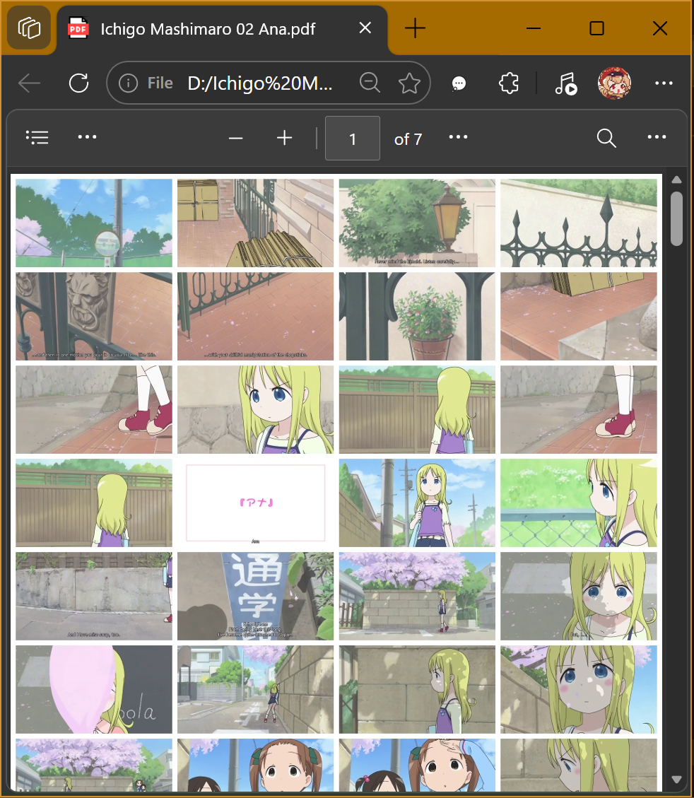

# MP42PDF 视频转分镜小工具

丢进去一个视频，吐出来一个分镜PDF。就这样。

适合用来：

- 抓人物动作和表情
- 看分镜和构图
- 给画画练习找参考
- 五分钟速通一整季番剧

*既然AI能替我们打工，不如也让它替我们看番。*

---

## 下载

👉 [点这里下载最新版](../../releases/latest)

（Windows，不用装任何东西，双击就能用）

---

## 怎么用

把视频文件拖到 `mp42pdf.exe` 上面，完事。

或者双击打开，点 Browse 选视频，再点Generate storyboard PDF from video。

PDF 会自动保存在视频旁边。